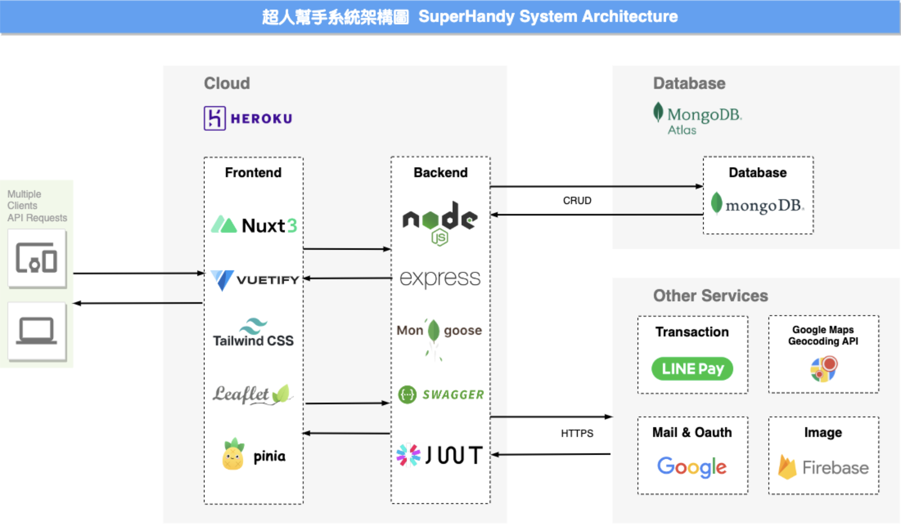

<p align="center">
  六角NodeJS課程-北三組共同開發<br></a>
<br>

</p>

## 網站主題
提供一個任務平台，平台兩個角色: 案主與幫手(接案者)。<br>
案主可以在平台上發布任務並支付薪水。<br>
幫手可以在平台上認領任務並獲取任務薪水。<br>

## 網站連結
[首頁](https://sh-v1.onrender.com/)
[API文件](https://sh-api-v1.onrender.com/api-doc/)


## 網站技術
本專案採前後端分離，前端採用 Vue 搭配 Nuxt3 框架開發，後端採用 NodeJs 搭配 Mongo DB。


## 網站地圖

## 快速開始

-   (1) 建立 `config.env`。 (可以複製 `example.env`)
-   (2) 執行 `npm install`。
-   (3) 依照你的環境去執行下方的程式碼。
-   (4) 運行swagger-doc:http://localhost:3000/api-doc。

```
//開發環境
npm run dev

//正式機環境
npm run prod

//Swagger開發文件
npm run swagger

```
